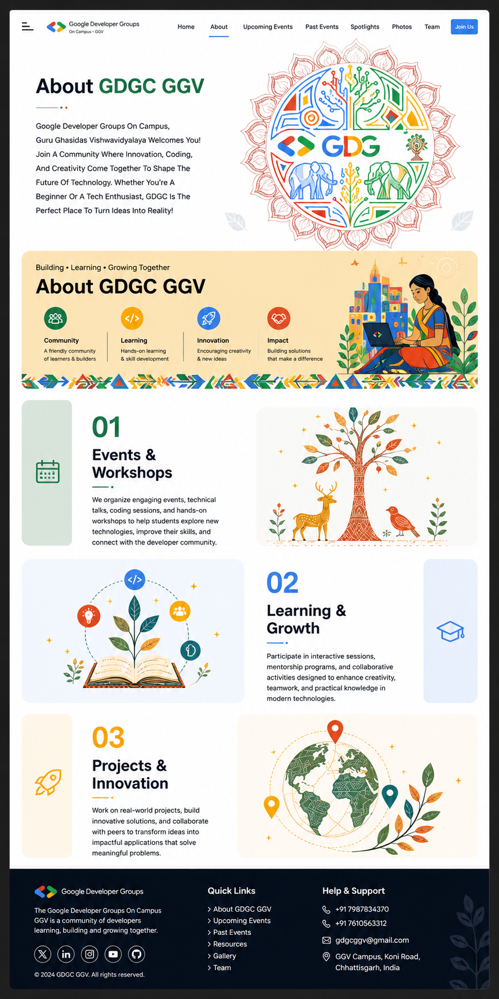
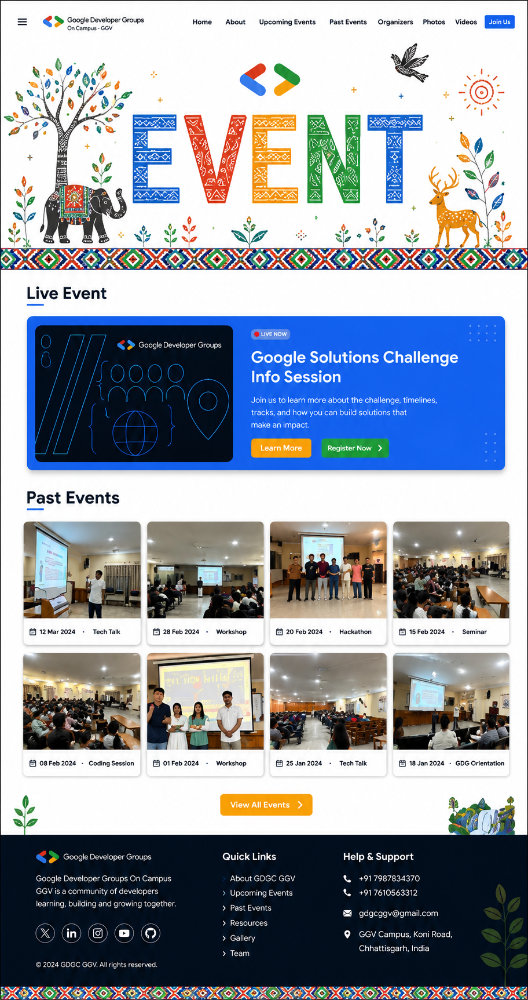
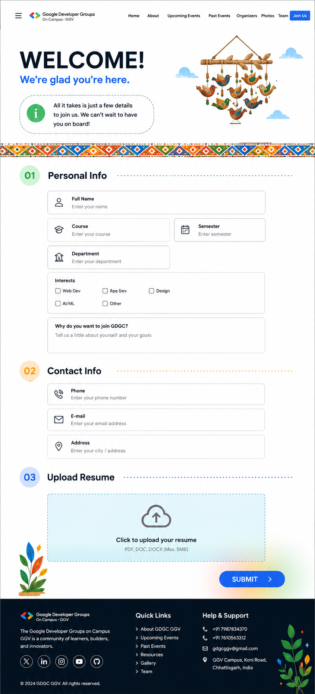
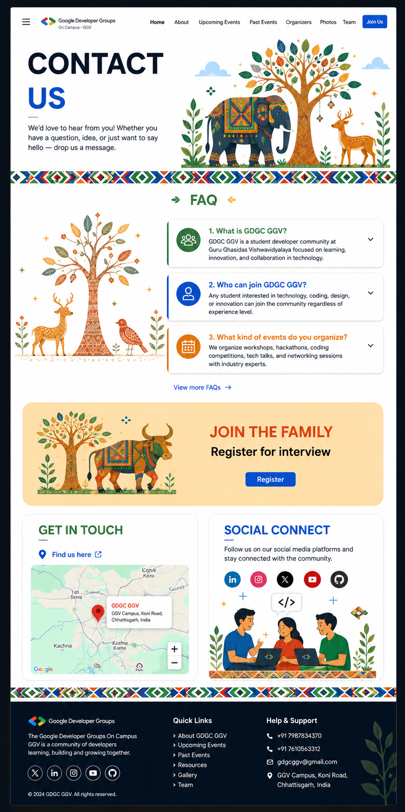

# 🌐 GDGC GGV Website

> Official website for **Google Developer Groups on Campus (GDGC)** at **Guru Ghasidas Vishwavidyalaya, Bilaspur**.


---

## 📖 About

The **GDGC GGV Website** serves as the official digital platform for the Google Developer Groups on Campus (GDGC) at Guru Ghasidas Vishwavidyalaya. It is designed to showcase the community, events, workshops, technical initiatives, projects, and student opportunities while providing an engaging experience for students and developers.

---
# 📸 Website Preview

## 🏠 Home

<p align="center">
  
</p>

---

## ℹ️ About

<p align="center">
  
</p>

---

## 📅 Events

<p align="center">
  
</p>

---

## 🤝 Join GDGC

<p align="center">
  
</p>

---

## 📞 Contact

<p align="center">
  
</p>

## ✨ Features

- 🎯 Modern & Responsive Design
- 👥 Team Showcase
- 📅 Events & Workshops
- 🚀 Projects & Initiatives
- 📸 Gallery Section
- 📰 Latest Updates
- 📞 Contact Section
- 🌙 Clean User Interface
- ⚡ Fast Performance
- 📱 Mobile Friendly

---

## 🛠 Tech Stack

| Technology | Usage |
|------------|-------|
| React.js | Frontend |
| Tailwind CSS | Styling |
| JavaScript | Programming |
| HTML5 | Structure |
| CSS3 | Styling |
| Vite | Build Tool |

---

## 📂 Project Structure

```
GDGC-GGV-Website
│
├── public/
├── src/
│   ├── assets/
│   ├── components/
│   ├── pages/
│   ├── hooks/
│   ├── styles/
│   └── App.jsx
│
├── package.json
├── vite.config.js
└── README.md
```

---

## 🚀 Getting Started

### Clone the Repository

```bash
git clone https://github.com/ayur546411-design/GDGC-GGV-Website.git
```

### Navigate to the Project

```bash
cd GDGC-GGV-Website
```

### Install Dependencies

```bash
npm install
```

### Start Development Server

```bash
npm run dev
```

---

## 📸 Website Sections

- 🏠 Home
- 💡 About GDGC
- 👨‍💻 Team
- 📅 Events
- 🚀 Projects
- 📰 Blogs / Updates
- 📷 Gallery
- 📞 Contact

---

## 🎯 Mission

Our mission is to foster a collaborative developer community by organizing workshops, hackathons, technical talks, and hands-on learning experiences that empower students to grow as developers and innovators.

---

## 🤝 Contributing

Contributions are welcome!

1. Fork the repository
2. Create a feature branch

```bash
git checkout -b feature-name
```

3. Commit your changes

```bash
git commit -m "Add new feature"
```

4. Push to GitHub

```bash
git push origin feature-name
```

5. Open a Pull Request

---

## 📬 Contact

**Google Developer Groups on Campus (GDGC)**  
**Guru Ghasidas Vishwavidyalaya, Bilaspur**

📧 Email: your-email@example.com

🌐 Website: https://your-website-link.com

---

## 📄 License

This project is licensed under the MIT License.

---

<div align="center">

### 💙 Built with passion by the GDGC GGV Team

**Empowering Student Developers • Building Communities • Learning Together**

⭐ If you found this project helpful, don't forget to star the repository!

</div>