Project Title
GDGC Website Redesign

1.Description
This project involves a comprehensive UI/UX redesign of the GDGC website to
improve community engagement and the overall user experience. Based on
competitive research and user flows, our team developed low-fidelity wireframes and
a structured site hierarchy for six core pages. We built a complete design system
and high-fidelity responsive screens in Figma to ensure visual consistency across
desktop and mobile. The final deliverable features an interactive prototype with
seamless transitions and a clear navigation structure. Through a rigorous review and
testing phase, the team ensured a functional, professional, and user-centric digital
presence for the community.

2.Overview
The GDGC Website redesign is a structured, team-based initiative to modernize the
digital presence of the Google Developer Group on Campus chapter. The project
follows a rigorous phase-wise workflow, including research, wireframing, and site
architecture, to transform community requirements into a high-fidelity digital
experience. Focusing on a mobile-first and responsive approach, the team is
designing six core pages: Home, About, Events, team, Contact, and Join
Community. The final deliverables include a fully interactive Figma prototype and a
comprehensive design system ensuring a seamless and cohesive user journey for
all community members.

3.Team members & Roles
• Harsh Sahu - Research
• Darsh Pamnani & Harsh Sahu - Wireframe
• Mandakni - Architecture
• Harshita Yadav, Harsh Sahu and Darsh Pamnani - UI Design
• Ayush Kumar - Content & Asset Management
• Abhishek Jaiswal,Mandakni, Harshita Yadav and Ayush Kumar - Prototype
• Sakshi Ghosh - Documentation
• Harsh Shrivastav - Review & Testing

4.Problem Statement
The existing GDGC website lacks a modern, responsive, and user-friendly design,
making it difficult for users to navigate, access event information, and engage with
the community. The project aims to redesign the website with improved UI/UX, better
navigation, responsive layouts, and interactive features to enhance the overall user
experience and community engagement.

5.Design process

1.Research phase
Prepared by: Harsh Sahu (researcher)
Date: May 12, 2026
1.Home page
• Header: Logo,Nav Links (Home, About, Events, Team, Contact),and “Join Us”
 button.
• Hero: bold headlines + “Join Community”CTA+Large illustration.
• Featured Events:Bento Grid style cards for upcoming events with “register” buttons.
• Stats & footer: Member/Event counters + social links(Linkedin,instagram)
2.About page
• Mission: Focused headlines on empowering GGV students.
• Core pillars: 3-column layout for learn, Share ,and Connect.
• Activities: Bento Grid showing Workshops,Hackathons, and Speakers sessions,
• Benefits: Quick -view card for Networking,Skills ,and Google Certificate.
3.Event page
• Main Features: large high-contrast card for the next big event (RSVP/Bevy link).
• Filters: Category bar(Web ,AI, cloud) to sort events.
• grid layout: 2*2 or 3*3 layout for all upcoming and past sessions
4.Team page
• Lead section: Featured profile card for the chapter lead.
• Core Team: Bento grid organised by department (Tech,Design,management).
• Interactivity: Profiles showing Tech Stacks on hover
5.Contact & Join
• Contact: Minimal form + Campus Location + Official email.
• Join us: 2-Step onboarding (Personal info-Tech interests)+ Social group links
 (WhatApp/Discord).
• Success State: “Welcome” message with a redirect to the event page.
Research Insights
• Home: High-energy hero section+ Bento Grid for a modern, scannable layout
 (Inspired by GDG Algiers).
• About: 3-Pillar structure (learn,Share,Connect) to show immediate student value
• Event: Category filters (AI/Web/Cloud)and high-contrast RSVP card to drive
 engagement.
• Team: Visual hierarchy featuring the lead,with hover -effect to show technical
 expertise.
• Join/Contact: 2-Step from to reduce”user fatigue” and direct links for instant
 community onboarding.

Reference links:
1. https://gdscghrce.in/

2. https://gdg.community.dev/gdg-on-campus-university-school-of-information-co
mmunication-technology-delhi-india/?hl=en-IN

3. https://gdg.community.dev/gdg-casablanca/?hl=en-IN

2. User Pain Points
• Users faced difficulty navigating through different sections due to an unclear
information hierarchy.
• Important information such as events, community activities, and resources was not
easily discoverable.
• The existing design lacked visual engagement and did not effectively represent the
community’s identity.
• Content organization made it difficult for users to quickly access relevant
information.
• The website required a more modern and user-friendly interface to improve the
overall user experience.

3.Wireframe phase

Prepared By: Harsh Sahu & Darsh Pamnani
Date: 14 may,2026
Design Reference for Wireframing
The following websites and design resources were studied to create effective
wireframing and improved the overall user experience and page structure.
1. https://gdscghrce.in/
2. https://gdg.community.dev/gdg-on-campus-university-school-of-information-communic
ation-technology-delhi-india/?hl=en-IN
3. https://gdg.community.dev/gdg-casablanca/?hl=en-IN
4. https://devfest.gdgchennai.in/?hl=en-IN
5. https://github.com/gdgchennai

1.Home Page

Purpose: To provide the first impression of GDGC and introduce the community.
Sections:
 • Header & navigation (Logo,menu,join button)
 • hero section(Introduction + CTA: Join Community)
 • Brief Description of GDGC
 • Activities Section(Event cards)
 • Community Structure(Flow chart)
 • Footer (LInks,contact,social media)
 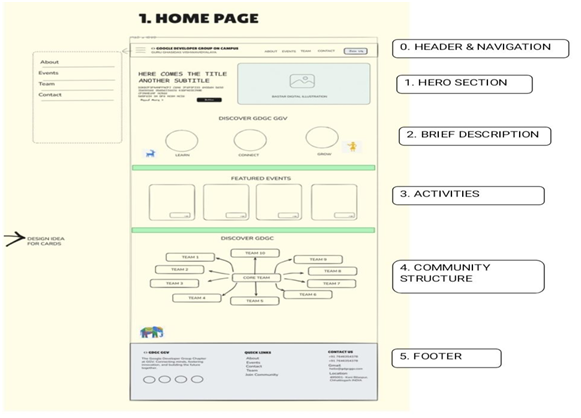

2.About Page

Purpose: To describe the identity, mission, and objectives of GDGC.
Sections:
 • Header
 • Mission Statement
 • Objectives(Hackathons, workshop,networking)
 • CTA:Join Us
 • Footer
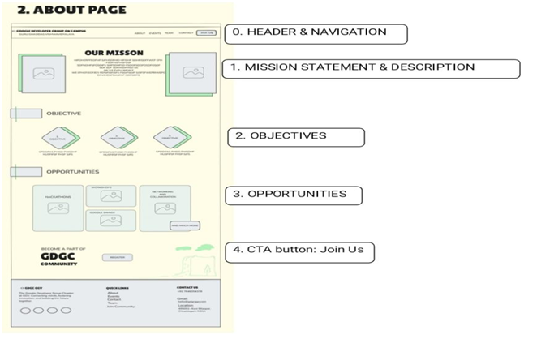

3. Event Page

Purpose: To display all the events and their details.
Sections:
 • Header
 • Title and search bar
 • On-going Events
 • Upcoming Event ( Card layout)
 • Past Events ( with view details option)
 • Footer
 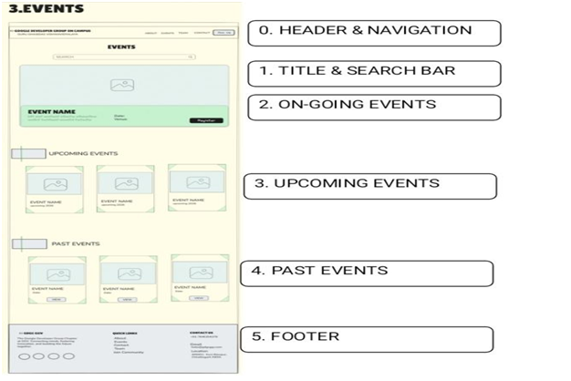

4.Contact Page

Purpose: To provide communication channels for users.
Sections:
 • Header
 • University Information
 • Social Media Links
 • Join Community CTA
 • Frequently Asked Question(FAQ)
 • Footer
 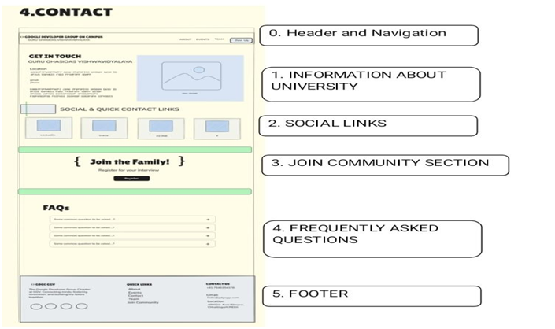

5.Team Page

Purpose: To Showcase core and other team members.
Sections:
 • Header
 • Core Team (card grid layout)
 • Other Teams (roles and members)
 • Footer
 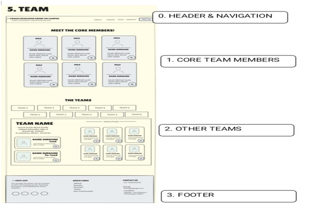

6.Join Community Page

Purpose:To allow users to apply for joining GDGC.
Sections:
 • Header
 • Personal Information ( basic detail, interests, reason for joining)
 • Contact Information
 • Resume Upload Section
 • Footer
 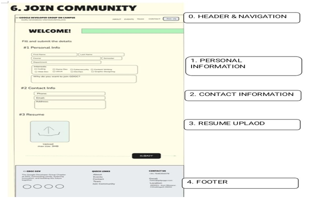

Design Recommendation

The UI design should reflect the cultural identity of Chhattisgarh to give a local and
unique feel.
Suggested Visual Style:
 • Baster art design element
 • Waterfall- inspired illustrations
 • Rice grain Textures
 • Animals morph-style graphics
 • Regional cultural aesthetics

4.Architecture phase

Prepared by : Mandakni
Date: May 20, 2026
Project overview
GDGC Community is a modern web dashboard architecture designed for a student
developer community platform. The project focuses on improving community
engagement, onboarding, event discoverability, and collaboration.
Strategic foundation
The architecture and layout planning were inspired by research and analysis of
successful developer community platforms, including:
• GDSC Algiers
• GDG Chennai
• GDG Casablanca
Key Inspiration
• Hero -section Energy
• Modular Dashboard card
• Accessibility focused UX
• Mission driven layout
Core Website Pages

1.Home Page
The home page accounts as the primary landing section of the website and includes:
• Hero section
• Featured events
• Community Statistics
• CTA Button

2. About Page
This section provides detailed information about the community.
Features:
• Community Mission
• Core values
• Student Benefits
• Timeline

3. Event Page
The event page is designed to manage and showcase community events.
Features:
• Upcoming Events
• Registration System
• Past Event Archive
• Event gallery

4.Team page
This page introduces the core members and organization structure.
Features:
• Core Team Member
• Department Information
• Skill Card

5.Contact Page
The Contact page enables communication between users and the community.
Features:
• Contact form
• Social Media Links
• Frequently asked Question(FAQ)

6.Join Community Page
Features:
• Multi-step Form
• Skill and Interests selection
• Confirmation Screen
Digital Baster Identity
A unique aspect of the project architecture is the integration of Baster tribal art
elements into the user interface design.
Design Element used:
• Dhokra geometric Patterns
• Tribal Separators
• Tree of Life visuals
• Cultural Motifs
Design System
Style
• Minimal Dashboard UI
• Rounded Cards
• Bento-grid layout
• Soft shadow
Tool used
• Figma
• FigJam
• Miro
• Excalidraw
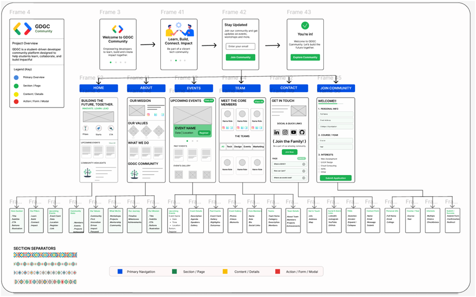

5.UI Phase

Prepared by:Harshita Yadav, Harsh Sahu and Darsh Pamnani
Date: May 21, 2026
1.Home Page
Prepared by:Harshita Yadav
• Navigation Bar: Contains the GDGC GGV logo on the left, links in the center, and a
“ Join Us”button on the right.
• Hero Section: Displays the main bold headline “Coding the Future Rooted in
Innovation”,a short community mission statement, a green “innovation tree”
illustration with students.
• Global Footer: Includes quick links,a Help & Support FAQ section, and social media
connection icons.
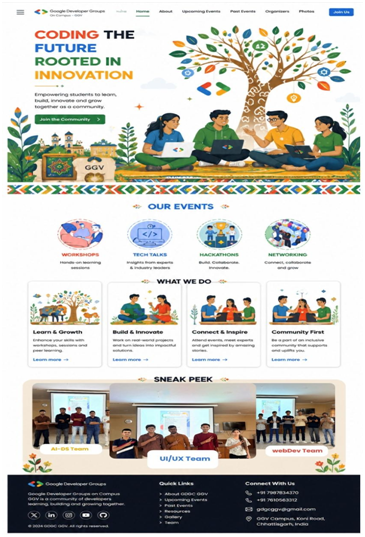

2. About Page
Prepared by: Harshita Yadav
• Mission Overview: An introductory section explaining the purpose of GDGC GGV.
• Core Pillars (3-Card Grid): * 01. Events & Workshops: For technical sessions.
 02. Learning & Growth: For skill development.
 03. Projects & Innovation: For building impactful products.
• Core Philosophy: Visual badges emphasizing “Built & Innovate”,”Connect &
 Inspire”, and “Community First”.
 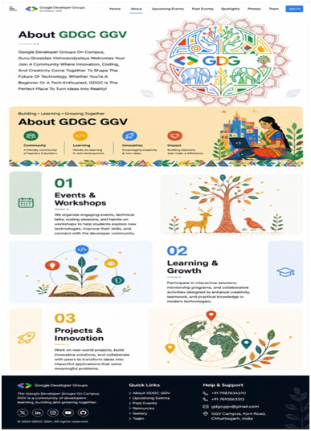

3. Event page
Prepared by: Harshita Yadav
• Event Toggle Navigation: Tabs to switch easily between "Live Event" and "Past
Events".
• Featured Event Card: A dedicated display card showing current event details (e.g.,
"Google Solutions Challenge Info Session").
• Sneak Peek Sidebar: A side panel showcasing dynamic updates like UX team
progress and daily activity metrics.
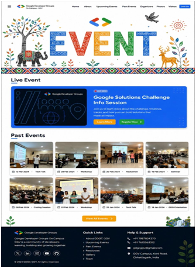

4. Team Page
Prepared by:Harsh Sahu
• Core Organizers: Profile grid showing circular member avatars (Rohit, Nuha, Rahul,
Rajat, etc.) with integrated LinkedIn profile shortcuts.
• Department Filter: A matrix bar to switch views between different departments
(Team 1 to Team 10).
• Executives Panel: A dynamic data list d
displaying the designated executive names and positions under the selected team.
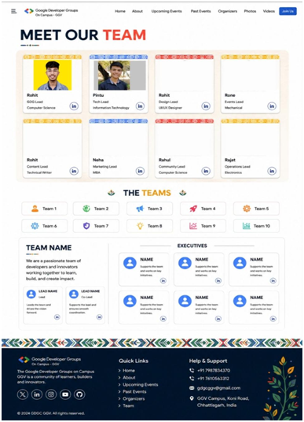

5. Join Community Page
Prepared by: Darsh Pamnani
• Welcome Banner: Displays a welcoming header: "WELCOME! We're glad you're
here.".
• 3-Step Form Wizard (Horizontal Stepper):
 Step 01: Personal Info fields.
 Step 02: Contact Info fields.
 Step 03: Upload Resume drag-and-drop zone.
• Action Control: A prominent solid "SUBMIT" button to register for the interview.
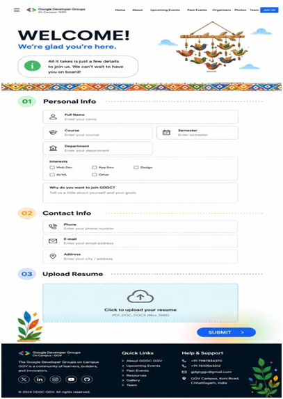

6. Contact Page
Prepared by: Harshita Yadav
• FAQ Section: Accordion components addressing common student queries.
• Contact Details Card: Displays phone numbers (+91 7987654370,
+91-7610563312) and the official email (gdgcggv@gmail.com).
• Location Block: Physical address text card pointing to GGV Campus, Koni Road,
Bilaspur, Chhattisgarh, India (ideal for a Google Maps iframe integration).
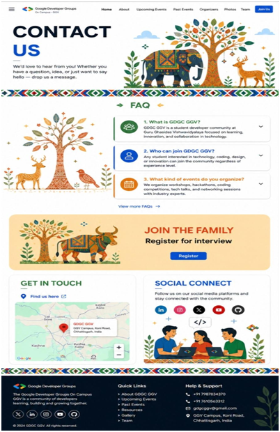

6. Prototype phase
Prepared by: Harshita Yadav, Mandakni, Ayush kumar and, Abhishek Jaiswal
Date: May 25, 2026
Prototype overview
The prototype of the GDGC GGV website was developed to provide a visual
representation of the system before the actual development phase. It helped in
understanding the overall layout, user interface design, navigation structure, and
user interaction flow. The prototype was designed with a modern and responsive
approach to ensure an improved user experience across different devices.
Tools used for prototype Design
• react.js
• github
Prototype Design Structure

1. Home Page
Component included:
• Navigation Bar
• Hero Section
• Community Introduction
• Featured Events
• CTA Button
• Footer Section
Description:
The homepage prototype was designed to create a strong first impression and
provide quick access to important sections of the website. The layout focused on
clarity, responsiveness, and modern visual design.

2. About Section
Component include:
• community overview
• Mission and Vision
• Achievement and Statistics
• Information Content
Description:
This Section was designed to present the purpose, goals, and identity of the GDGC
GGV community in a clear and professional format.

3. Event Section
Component Included:
• Event Cards
• Workshop Information
• Event Description
• Registration Buttons
• Upcoming Activities
Description:
The event section prototype was developed to display technical events, workshops,
and activities using an organized card-based interface for better user engagement.

4. Team Section
Component Included:
• Team Member profiles
• Position and Role Details
• Member Images
• Social Media Links’
Description:
The team section prototype highlights the core members and contributors of the
community in a professional and visually structured manner.

5. Join community Section
Components Included:
• Registration Form
• Input fields
• Community Benefits Section
• CTA Button
Description:
The join community page prototype allows users to register and become part of the
GDGC GGV community. It provides a simple form for entering details and highlights
the benefits of joining.

6. Contact Section
Component Included:
• Contact form
• Email Information
• Social Media Links
• Footer Section

Description:
The Contact page prototype provides an easy way for users to communicate with
the GDGC GGV community through a contact form, Email, and social media links.
Prototype Development Process
1. Requirement Analysis
2. Wireframe creation
3. User Interface Design
4. Interface Prototype Developement
5. Navigation Testing
6. Final Design Evaluation
Prototype Testing
The prototype was tested to evaluate:
• Navigation efficiency
• Responsive behaviour on different devices
• Visual consistency
• User accessibility
• Interface usability
UI/UX Features of the Prototype
• Responsive design
• Clean user Interface
• Interactive Navigation
• Consistent color Palette
• Structured layout Design
• Modern Typography
• Accessibility- Focused Design
• Card-Based Content Organization

7. Tech stack
Wireframing
Tool used: Visily
Visily was used to create low-fidelity wireframes and establish the initial layout
structure of the website.
Architecture
Tool used: Figma
Figma was used to organize content, define page hierarchy, and structure the
website’s navigation flow.
UI Design
Tool Used: Figma
Figma was used to design high-fidelity user interfaces and maintain visual
consistency across all pages.
Prototyping
Tool Used: React.js
React.js was used to develop an interactive prototype with realistic navigation and
user interactions.
Version control & Collaboration
Tool Used: GitHub
GitHub was used to manage project files, track changes, and support collaboration
throughout the project.

Final Project
Overview
The Final project presents the complete UI design and implementation of the GDGC
GGV website. It was developed after completing the phases of research, architecture
planning, wireframing, UI design, and prototype. The website is designed for
community engagement, information sharing, and event management.
Website Link: https://gdgc-ggv.web.app/

1. Home page
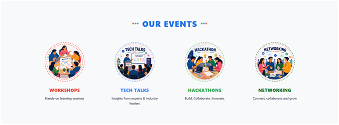
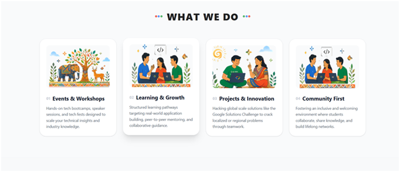
Google Developer Groups
The Google Developer Groups on Campus GGV
isa community of learners, builders and
innovators.
gh
©2024 GDGC GGV. All rights reserved
Quick Links Help & Support
Home +91 7987834370
About +91 7610563312
gdgcggv@gmail.com Upcoming Events
Past Events
Organizers
Team
GGV Campus, Koni Road,
Chhattisgarh, India
<
Al-DS Teaon
SNEAK PEEK
UI/UX Team
webDev Team
>
WHAT WE DO
</>
01 Events & Workshops
Hands-on tech bootcamps, speaker
sessions, and tech fests designed to
scaleyour technical insights and
industry knowledge.
02 Learning & Growth
Structured learning pathways
targeting real-world application
building, peer-to-peer mentoring, and
collaborativeguidance
03 Projects & Innovation 04 Community First
Hacking global scale solutions like the
Google Solutions Challenge to crack
localized or regional problems
through teamwork
Fostering an inclusive and welcoming
environment where students
collaborate, share knowledge, and
build lifelong networks.
WORKSHOPS
Hands-on learning sessions
... OUR EVENTS ...
TECH TALKS HACKATHON NETWORKING
TECH TALKS HACKATHONS NETWORKING
Insights from experts & industry
leaders
Build. Collaborate. Innovate. Connect, collaborate and grow
CODING THE
FUTURE
ROOTED IN
INNOVARION
</>
{}
Empowering students to learn, build, innovate and grow
together as a community.
Join the Community
Home About Upcoming Events Organizers Contact Join Us
ㅇ
200
</>
*
• Description: 
The Home Page successfully provides an engaging introduction to
the GDGC GGV community through a clear layout, intuitive navigation, and
prominent CTA elements, improving user engagement and accessibility.

2. About Page
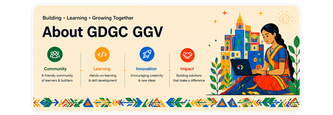
• Description:The About Page effectively presents the community’s objectives,
mission, and achievement in a structured format, helping users gain a better
understanding of the organization.

3. Event page
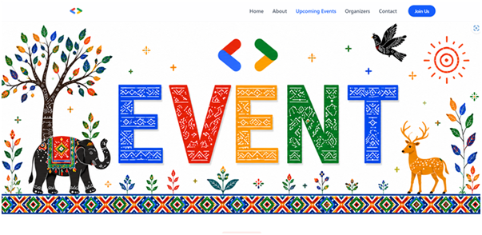
• Description: The Events Page successfully organizes event information in an
accessible manner, enabling users to explore and participate in workshops,
hackathons, and community activities.

4. Teams Page
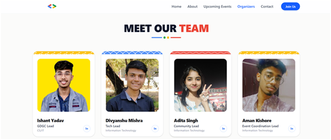
• Description: The Teams Page showcases the core team members and
contributors of the community.

5. Join Community Page
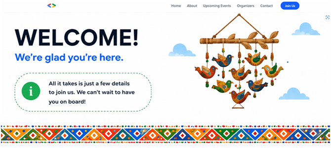

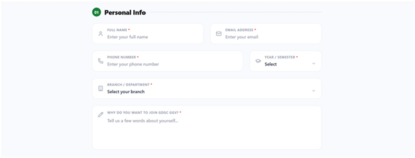
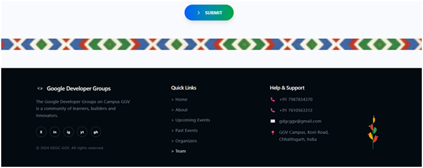
• Description: This page allows users to join the community by registering or

applying through the provided form or link.
6. Contact Page
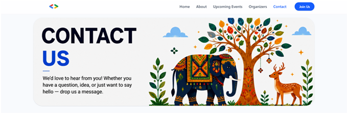
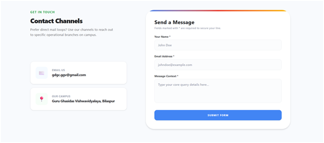
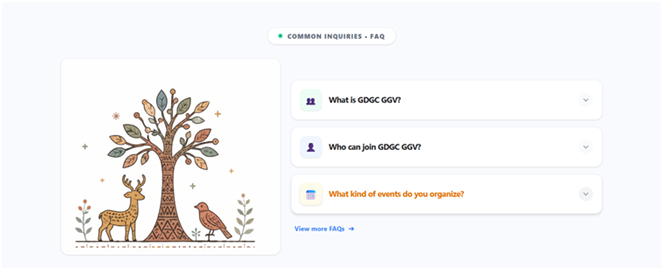
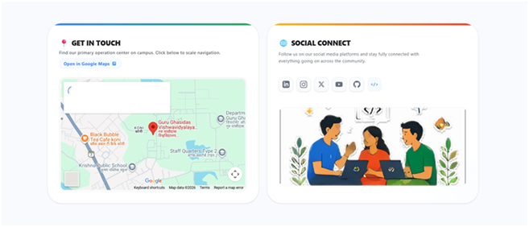
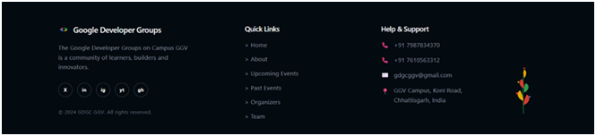
• Description:The contact page enables effective communication between users
and the community by offering multiple channels for inquiries, feedback, and support.
Key Features of the Final Output
• Responsive and modern UI design
• Easy navigation across all pages
• Consistent design system
• Community-Focused structure
• Clean and user-friendly interface
Result
The successful completion of the GDGC GGV website redesign in a modern,
user-friendly, and responsive platform that effectively represents the
community and its activities. The final design achieved the project objectives.
The final design achieved the project objectives by improving navigation,
enhancing visual consistency, and creating an engaging user experience
across all major sections of the website.